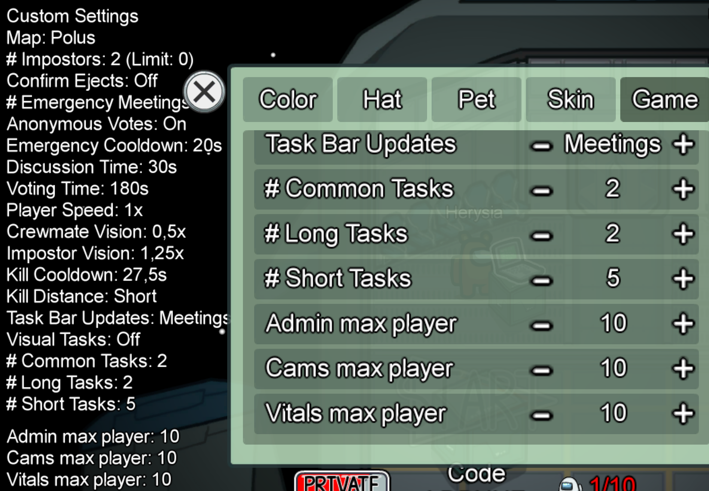
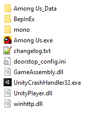

# AmongUsTryhard

Among us mod that fixes some game breaking bugs when tryharding among us. As well as some useful settings

## Features

-   Fixes admin table blink issue (https://youtu.be/aMEH0wGjyZ8)
-   Fixes the fact that vent's animation is visible in the shadow (https://youtu.be/vL3xS9cFSPY)
-   Allow you to disable Cameras, Admin table and Vitals when there are less than N players, updated at meetings (customizable)
-   Crewmates can use scanner at the same time (prevent scan abuse)
-   Fixes some cases when impostor is invisible after exiting a vent
-   Removes the kill button blink when one of your teammates kills
-   Option to hide player names (excluding yours and your impostor's teammates) to prevent wall/door clipping
-   Option to change the % of kill cooldown after a meeting
-   Option to force wire task (it's still counted as a "common task")
-   Allow you to change map and impostor count from the game lobby (Thx [@Galster](https://github.com/Galster-dev))



## Technical stuff

This mod has been made using [Reactor modding framework](https://github.com/NuclearPowered/Reactor), based on BepInEx, it patches the game at runtime and **DOES NOT** modify any game files.

-   Support Among us v2020.12.9s (Steam only)

### Installation

All players should have the mod install for the best user experience

-   Download the [lastest release](https://github.com/Herysia/AmongUsTryhard/releases/latest).
-   Extract the files into Among us game folder (`steam/steamapps/common/Among us`)
-   This should look like this
    
-   **Run the game from steam**

### Installation side note

If you want to install Reactor by yourself, please follow the [BepInEx](https://docs.reactor.gg/docs/basic/install_bepinex) installation instruction, then [Reactor](https://docs.reactor.gg/docs/basic/install_reactor)'s ones. And then copy the plugin dll (from [releases](https://github.com/Herysia/AmongUsTryhard/releases/latest)) into `Among us/BepInEx/plugins`
If you want to play on official servers, you should then disable custom handshake option from: `Among us/BepInEx/config/gg.reactor.api.cfg`

### Uninstall

If you want to uninstall this mod only, remove the dll `Among us/BepInEx/plugins/AmongUsTryhard-2020.12.9s.dll`.

If you want to disable it, you can temporarily rename or remove the file `Among us/winhttp.dll`

If you want to completely uninstall Reactor/BepInEx, remove the following files and folders

```
+-- BepInEx
+-- mono
+-- changelog.txt
+-- doorstop_config.ini
+-- winhttp.dll
```

# Contributing

You have encountered a bug or unexpected behaviour ? You want to suggest or add a new feature ? Create an [Issue](https://github.com/Herysia/AmongUsTryhard/issues) or [PR](https://github.com/Herysia/AmongUsTryhard/pulls) !

### Dependency

This mod depends on [another module](https://github.com/Herysia/CustomLobbyOptions) which simplify lobby options (add to menu, sync settings and save settings individually with customisable display)

### Creating PR

-   [Fork this on github](https://github.com/Herysia/AmongUsTryhard/fork)
-   Clone your repo, commit and push your changes
-   Request a new Pull request

# Licensing & Credits

AmongUsTryhard is licensed under the MIT License. See [LICENSE](LICENSE.md) for the full License.

Credits to [@Galster](https://github.com/Galster-dev) for custom lobby settings

Third-party libraries:

-   [Reactor](https://github.com/NuclearPowered/Reactor) is license under the LGPL v3.0 License. See [LICENSE](https://github.com/NuclearPowered/Reactor/blob/master/LICENSE) for the full License.
-   [BepInEx (Reactor fork)](https://github.com/NuclearPowered/BepInEx) is licensed under the LGPL 2.1 License. See [LICENSE](https://github.com/NuclearPowered/BepInEx/blob/master/LICENSE) for the full License.
-   Unity Runtime libraries are part of Unity Software.  
    Their usage is subject to [Unity Terms of Service](https://unity3d.com/legal/terms-of-service), including [Unity Software Additional Terms](https://unity3d.com/legal/terms-of-service/software).

# Contact

### Discord: Herysia#4293
